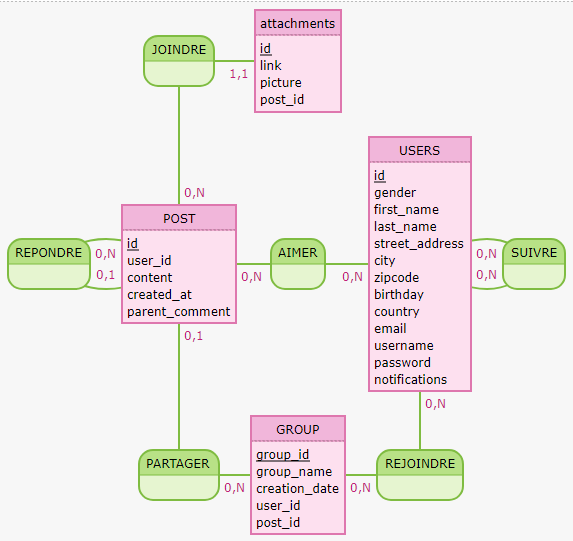

# Analyse des besoins et MCD

Pour commencer, je vais analyser les besoins du clients et faire un diagramme afin de commencer le projet avec des bases solides.

# Fonctionnalités à intégrer dans la BDD

- Créer un prototype de base de données

- L'utilisateur peut : 
    - Voir le contenu le plus populaire du réseau

    ou
    - passer sur un autre fil des posts les plus récents 

- L'utilisateur connecté peut interagir avec les autres utilisateurs en :
    - Likant les publications
    - Commentant les publications
    - Répondant à un commentaire
    - Suivant un autre utilisateur

- Créer un système de recherche par mot clé pour les utilisateurs et les publications

- Pouvoir filtrer les publications par date, auteur, etc.

- Pouvoir créer des groupes de partages avec des rôles

# Requêtes à préparer pour le dev fullstack

- Requête d'insertion en base d'un utilisateur.

- Requête permettant de lire les données qui seront injectées dans la page profil d'un utilisateur, probablement a partir d'un nom d'utilisateur.

- Requête pour afficher les commentaires d'un post ainsi que son nombre de "like"

- Requête pour créer un nouveau post avec sa pièce jointe.

- Requête pour récupérer toutes les réponses d'un commentaire.

- Requête pour afficher les paramètres utilisateur et les modifier.

- Requête pour récupérer les posts pour chacun des fils d'actualités avec leurs nombre de "like" et de partages.

# Notes diverses pour le dev fullstack
Un utilisateur pourra accéder à la plateforme sans être connecté, mais s'il veut intéragir avec le réseau social, il devra créer un compte.
A ce moment, il pourra compléter sa page profil avec quelques informations personnelles.

Quand il sera inscrit, un utilisateur sera amené à faire sa première publication. Il sera aiguillé grâce à une sorte de guide d'utilisation du réseau, mais il pourra passer cette étape.

L'utilisateur pourra désactiver ses notifications s'il le souhaite.

Lorsqu'il y aura une réponse à un commentaire, elle devra être imbriquée à celui-ci pour une meilleure visualisation.

# RESSOURCES UTILISEES
 - SGBD utilisé : postgres
 - Notes personnelles
 - FakeNameGenerator pour récupérer de faux utilisateurs
 - Mocodo pour la création du MCD
 - Flavien
 - copilot (uniquement pour la génération du contenu des posts fictifs)
 - Jérôme, Jérémy et Soumaya